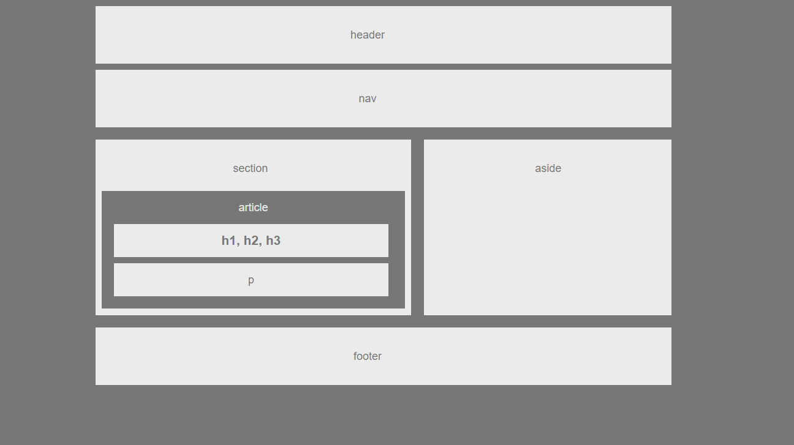

<!-- Put the name of the project after the # -->
<!-- the # means h1  -->
# HW-Wireframe

<!-- Put a description of what the project is -->
Learning html,css,floats,positioning

## Link to deployed site
<!-- make a link to the deployed site --> 
<!-- [What the user will see](the link to the deployed site) -->
[hw-wireframe](https://ajitas.github.io/HW-Wireframe/)

## Images
<!-- take a picture of the image and add it into the readme  -->
<!--  -->


## technology used
<!-- make a list of technology used -->
<!-- what you used for this web app, like html css -->

<!-- 
1. First ordered list item
2. Another item
⋅⋅* Unordered sub-list. 
1. Actual numbers don't matter, just that it's a number
⋅⋅1. Ordered sub-list
4. And another item. 
-->
1. HTML
2. CSS
    * float
    * position
    * padding


## code snippets
<!-- put snippets of code inside ``` ``` so it will look like code -->
<!-- if you want to put blockquotes use a > -->

```
<header>
    header
</header>
<nav>
    nav
</nav>
<section>
    section
    <article>
    article
    <div><strong>h1,h2,h3</strong></div>
    <p>p</p>
    <br>
    </article>
</section>
<aside>aside</aside>
<footer>
    footer
</footer>
```
## Learning points
* Idea behind the classes and ids
* concept of box model
* positioning of html elements using css float,padding


## Author 
[Ajita Srivastava](https://github.com/ajitas)

## License
Standard MIT License